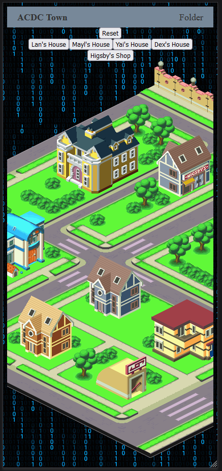
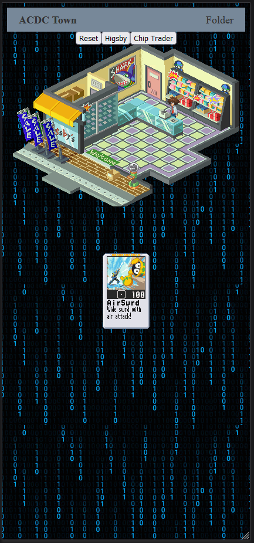

# NetNavi-Explorer

Welcome to ACDC Town, home of world famous net battler Lan Hikari and his Net Navi MegaMan.EXE! On this interactive site, you can explore the town, check out the shop, and learn all about the characters who reside here!

## Project Links

- **Deployed Site**: [NetNavi-Explorer](https://netnavi-explorer-3190ef67dfa0.herokuapp.com)
- **Project Management**: [Trello Board](https://trello.com/b/NITLXd1g/netnavi-explorer)

## Technologies Used

This project is built using the MERN stack:

- **MongoDB**: A NoSQL database that stores data in flexible, JSON-like documents, allowing for intuitive development and scalability.
- **Express.js**: A web application framework for Node.js, designed for building web applications and APIs.
- **React**: A JavaScript library for creating user interfaces that enhance user interaction and engagement through dynamic content.
- **Node.js**: A JavaScript runtime built on Chrome's V8 JavaScript engine, enabling server-side scripting and the creation of scalable network applications.

The most noteworthy libraries that were used for this project are:

- **react-zoom-pan-pinch**: This library enabled utilizing the maps found on the home page and in Higsby's shop.
- **react-beautiful-dnd**: This library enabled the drag and drop functionality found in the folder section of the website.
- **libgif**: This library enabled the control over the GIF that appears when interacting with the Chip Trader in Higsby's shop.
  
## Getting Started

To experience ACDC Town for yourself, follow these simple steps:

1. Fork and clone this repository
2. Fork and clone the [backend repository](https://github.com/AdamRWeinstein/netnavi-explorer-backend)
3. Create an .env file within the backend repository and provide a URL to your MongoDB instance
4. Point the front end API calls to your local host
5. Install any packages for both front and backend with `npm i`
6. Run `npm run dev` on both the front and backend from the command line.
7. Open up the localhost where your front end is running and enjoy!

Or you can visit the deployed site above!

## Screenshots

NetNavi Explorer is meant to be enjoyed as a mobile experience, and the screnshots reflect that.

*Explore the vibrant streets and corners of ACDC Town.*

*Check out the Chip Trader at Higsby's Shop!*

## Future Updates

- **Folders**: Folders can be improved to impose the same limitations as those found in the games
- **PET**: An integration with ChatGPT to have your very own NetNavi at your fingertips!

## Connect
- [LinkedIn](https://www.linkedin.com/in/adam-rick-weinstein)

## Credits

All the characters and copyrights belong to Capcom. 
This is just a fan project for the purpose of education.

Thank you for visiting ACDC Town – we hope you enjoy your stay!
